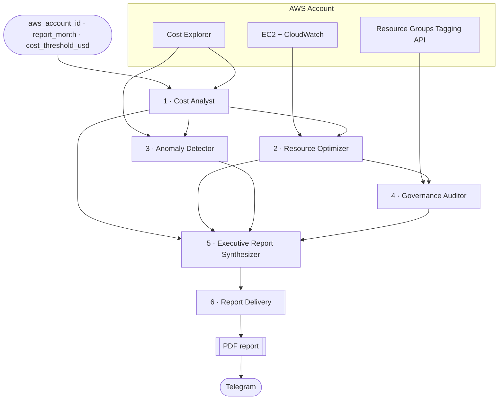

# AWS FinOps AI Multi-Agent System with CrewAI
 
> An autonomous chain of **6 specialized AI agents** that analyzes an AWS account's spending, hunts down wasted resources, detects cost anomalies, audits tagging compliance, and delivers an **executive PDF report straight to Telegram** — end to end, with no human in the loop.


---

## Table of contents

- [Why this project](#why-this-project)
- [At a glance](#at-a-glance)
- [Architecture](#architecture)
- [The 6 agents](#the-6-agents)
- [Custom tools](#custom-tools)
- [Why sequential, not parallel?](#why-sequential-not-parallel)
- [Security model](#security-model)
- [Project structure](#project-structure)
- [Getting started](#getting-started)
- [Sample output](#sample-output)
- [Documentation](#documentation)
- [Author](#author)

---

## Why this project

FinOps work on AWS is repetitive: pull Cost Explorer data, compare it to last month, look for idle EC2 instances and forgotten EBS volumes, chase untagged resources, then turn all of that into something a manager can read. Each step is simple; doing all of them every month, consistently, is not.

This project automates the whole loop. Each agent owns one FinOps discipline, calls **real AWS APIs through boto3**, and hands a structured JSON result to the next agent. The last agent turns the consolidated analysis into a PDF and pushes it to stakeholders on Telegram.

## At a glance

| | |
|---|---|
| **Agents** | 6, executed sequentially |
| **Custom tools** | 10 (8 AWS data tools + 2 delivery tools) |
| **AWS services queried** | Cost Explorer, EC2, CloudWatch, Resource Groups Tagging API |
| **Access level** | Read-only IAM user |
| **Output** | Unified JSON report (dashboard-ready, `ngx-echarts` compatible) + PDF delivered via Telegram |
| **Framework / LLM** | CrewAI · Gemini 2.0 Flash |

## Architecture

The pipeline is launched with three inputs, which flow through every agent:

| Variable | Example | Purpose |
|---|---|---|
| `aws_account_id` | `123456789012` | Passed to every boto3 tool |
| `report_month` | `2025-06` | Sets the Cost Explorer date range |
| `cost_threshold_usd` | `1000` | Minimum impact for an anomaly to be reported |



Each agent is defined by five elements — **role**, **goal**, **backstory**, **context** (outputs of previous agents) and **tools** (the APIs it is allowed to call). From these, the agent decides on its own which tools to call, in which order, and how to interpret the results into a structured output for the next agent.

## The 6 agents

| # | Agent | Tools | Receives context from | Output |
|---|---|---|---|---|
| 1 | **Senior AWS FinOps Cost Analyst** | `get_cost_by_service`, `get_cost_trend`, `get_cost_forecast` | — (first agent) | `cost_summary` |
| 2 | **Cloud Resource Optimization Specialist** | `list_ec2_instances`, `list_unattached_ebs`, `list_unused_elastic_ips` | Agent 1 | `optimization_recommendations` |
| 3 | **Cost Anomaly Detection Specialist** | `get_cost_anomalies`, `get_cost_trend` | Agent 1 | `anomalies` |
| 4 | **Cloud Governance & Compliance Auditor** | `check_tagging_compliance` | Agent 2 | `governance_score` |
| 5 | **FinOps Executive Report Synthesizer** | none — pure LLM reasoning | Agents 1–4 | Unified JSON report |
| 6 | **FinOps Report Delivery Specialist** | `generate_pdf_report`, `send_telegram_report` | Agent 5 | Delivery confirmation + Telegram message ID |

<details>
<summary><b>1 · Cost Analyst</b> — where is the money going?</summary>

Pulls monthly cost per service, computes the month-over-month change and **flags any service up more than 20%**. Retrieves the 30-day daily trend (peaks and troughs) and a 30-day forecast at 85% confidence. Returns the top 3 cost drivers plus `daily_trend_series` ready for charting.
</details>

<details>
<summary><b>2 · Resource Optimizer</b> — what are we paying for but not using?</summary>

Finds EC2 instances with **average CPU below 10% over 7 days** (right-size or terminate candidates), **unattached EBS volumes** (100% waste) and **Elastic IPs with no association** (~$3.65/month each). Every finding carries an estimated monthly saving, and the list is sorted by savings, with a per-type breakdown (EC2 / EBS / EIP) for a pie chart.
</details>

<details>
<summary><b>3 · Anomaly Detector</b> — did anything spike?</summary>

Queries Cost Explorer anomalies over a 90-day lookback, filtered by `TotalImpact >= cost_threshold_usd`, and cross-references them with the daily trend. Each alert is classified by severity (critical / warning / info) and enriched with a probable root cause and a recommended action.
</details>

<details>
<summary><b>4 · Governance Auditor</b> — can we attribute the spend?</summary>

Audits every resource (paginated) for the required tags **`Owner`, `Project`, `Environment`**. Computes a governance score `= compliant / total × 100`, a breakdown of missing tags, the top violating services and a remediation list prioritized by monthly cost.
</details>

<details>
<summary><b>5 · Executive Synthesizer</b> — what should leadership do?</summary>

Uses no tools. Merges the four previous outputs into a single JSON report: a 3–5 sentence executive summary, `total_potential_savings_usd`, and 5–8 `priority_actions` ranked by impact. Large arrays are stripped to keep the output under ~6,000 characters, which keeps the hand-off to the next agent reliable.
</details>

<details>
<summary><b>6 · Report Delivery</b> — get it in front of a decision-maker.</summary>

Generates a two-page A4 PDF from the report, then sends it as a document through the Telegram Bot API. The task is only considered done once a Telegram message ID confirms delivery.
</details>

## Custom tools

### AWS data tools (boto3)

| Tool | AWS API | What it does |
|---|---|---|
| `get_cost_by_service` | Cost Explorer `get_cost_and_usage` (MONTHLY) | Monthly cost grouped by service + MoM change |
| `get_cost_trend` | Cost Explorer `get_cost_and_usage` (DAILY) | Daily cost over the last 30 days |
| `get_cost_forecast` | Cost Explorer `get_cost_forecast` | 30-day forecast, 85% confidence |
| `list_ec2_instances` | EC2 `describe_instances` + CloudWatch `get_metric_statistics` | All instances with 7-day average CPU |
| `list_unattached_ebs` | EC2 `describe_volumes` (`state=available`) | Volumes not attached to anything |
| `list_unused_elastic_ips` | EC2 `describe_addresses` | EIPs without an `AssociationId` |
| `check_tagging_compliance` | Resource Groups Tagging API `get_resources` | Checks `Owner` / `Project` / `Environment` on every resource |
| `get_cost_anomalies` | Cost Explorer `get_anomalies` | 90-day anomalies above the threshold |

### Delivery tools

| Tool | Technology | What it does |
|---|---|---|
| `generate_pdf_report` | Pure Python (`io.BytesIO`) | Builds a valid PDF 1.4 from scratch — no external PDF library |
| `send_telegram_report` | `requests` → Telegram Bot API `sendDocument` | Reads the PDF from `/tmp/` and sends it to the configured chat |

> **Design choice:** the PDF tool returns `pdf_path`, `period`, `total_cost_usd` and `total_savings_usd` as separate values, and the Telegram tool reads the file from disk. Passing a file path instead of the raw PDF bytes keeps large binary content out of the LLM's context.

## Why sequential, not parallel?

This is a **chain of reasoning**, not a set of independent jobs:

- Agent 2 sizes its recommendations using the cost context from Agent 1.
- Agent 3 cross-checks anomalies against the trends computed by Agent 1.
- Agent 5 needs all four previous outputs to produce a coherent report.

Running them in parallel would be faster but would lose that shared context.

## Security model

- **Least privilege:** the agents run as a dedicated IAM user (`finops-agent`) with only two AWS-managed policies — `AWSBillingReadOnlyAccess` and `ReadOnlyAccess`. The system can **observe but never modify** the account: recommendations such as "terminate this instance" are reported, not executed.
- **No hard-coded secrets:** every tool builds its boto3 session from environment variables.

```python
session = boto3.Session(
    aws_access_key_id=os.environ.get("AWS_ACCESS_KEY_ID"),
    aws_secret_access_key=os.environ.get("AWS_SECRET_ACCESS_KEY"),
    region_name=os.environ.get("AWS_DEFAULT_REGION", "us-east-1"),
)
```

> ⚠️ Cost Explorer API calls are billed by AWS (about $0.01 per request). One full run makes only a handful of calls, but keep it in mind before scheduling frequent runs.

## Project structure

```
aws_finops_multi_agents/
├── knowledge/
├── src/aws_finops_multi_agents/
│   ├── config/
│   │   ├── agents.yaml          # role, goal, backstory of each agent
│   │   └── tasks.yaml           # task descriptions, expected outputs, context links
│   ├── tools/
│   │   ├── get_cost_by_service.py
│   │   ├── get_cost_trend.py
│   │   ├── get_cost_forecast.py
│   │   ├── get_cost_anomalies.py
│   │   ├── list_ec2_instances.py
│   │   ├── list_unattached_ebs.py
│   │   ├── list_unused_elastic_ips.py
│   │   ├── check_tagging_compliance.py
│   │   ├── generate_pdf_report.py
│   │   └── send_telegram_report.py
│   ├── crew.py                  # wires agents, tasks and tools together
│   └── main.py                  # entry point, defines the input variables
├── tests/
├── .env.example
├── pyproject.toml
└── uv.lock
```

## Getting started

### Prerequisites

- Python 3.10–3.13 and [uv](https://docs.astral.sh/uv/)
- The CrewAI CLI: `uv tool install crewai`
- An AWS account with **Cost Explorer enabled** and a read-only IAM user (see [Security model](#security-model))
- A Gemini API key
- A Telegram bot (created with [@BotFather](https://t.me/BotFather)) and the target chat ID

### 1. Clone and install

```bash
git clone https://github.com/AyoubElmortaji/AWS-FinOps-AI-Multi-Agent-System-with-CrewAI.git
cd AWS-FinOps-AI-Multi-Agent-System-with-CrewAI
crewai install        # creates the virtual env and installs dependencies from uv.lock
```

### 2. Configure environment variables

Create a `.env` file at the project root (never commit it):

```env
# LLM
MODEL=gemini/gemini-2.0-flash
GEMINI_API_KEY=your_gemini_api_key

# AWS (read-only IAM user)
AWS_ACCESS_KEY_ID=your_access_key
AWS_SECRET_ACCESS_KEY=your_secret_key
AWS_DEFAULT_REGION=us-east-1

# Telegram delivery
TELEGRAM_BOT_TOKEN=your_bot_token
TELEGRAM_CHAT_ID=your_chat_id
```

### 3. Set the inputs and run

Edit the `inputs` dictionary in `src/aws_finops_multi_agents/main.py`:

```python
inputs = {
    "aws_account_id": "123456789012",
    "report_month": "2025-06",
    "cost_threshold_usd": 1000,
}
```

Then launch the crew:

```bash
crewai run
```

The agents run one after another; when the last one finishes, the PDF report arrives in your Telegram chat.

## Sample output

Final confirmation from the delivery agent:

```
PDF Generation:     /tmp/finops_report.pdf          [OK]
Telegram Delivery:  success — Message ID: 3         [OK]

Report: finops_report_2026-07.pdf
Period: 2026-07 | Total Spend: $28,322.15 | Savings: $4,349.27
```

Excerpt of the unified JSON report produced by Agent 5:

```json
{
  "report_metadata": { "generated_at": "2026-07-20T12:00:00Z", "period": "2026-07", "report_version": "1.0" },
  "executive_summary": "In July 2026, total AWS spend reached $28,322.15...",
  "total_potential_savings_usd": 4349.27,
  "priority_actions": [
    { "action": "Implement IAM boundaries for EC2", "impact_usd": 2230.5, "effort": "medium", "category": "anomaly", "timeframe": "immediate" }
  ]
}
```

Every chart-related block (`daily_trend_series`, `savings_by_type_chart`, `severity_chart_data`, `compliance_donut_chart_data`) follows the `ngx-echarts` data format, so the report can feed an Angular dashboard directly.

## Documentation

The full technical write-up (in French) — detailed goals, backstories, tasks and expected JSON schemas for each agent — is available in [`AWS_FinOps_Agent.pdf`](./AWS_FinOps_Agent.pdf).

## Author

**Ayoub ELMORTAJI** — Engineering student in Cybersecurity & Cloud Computing, ENSAM Casablanca

[GitHub](https://github.com/AyoubElmortaji)
